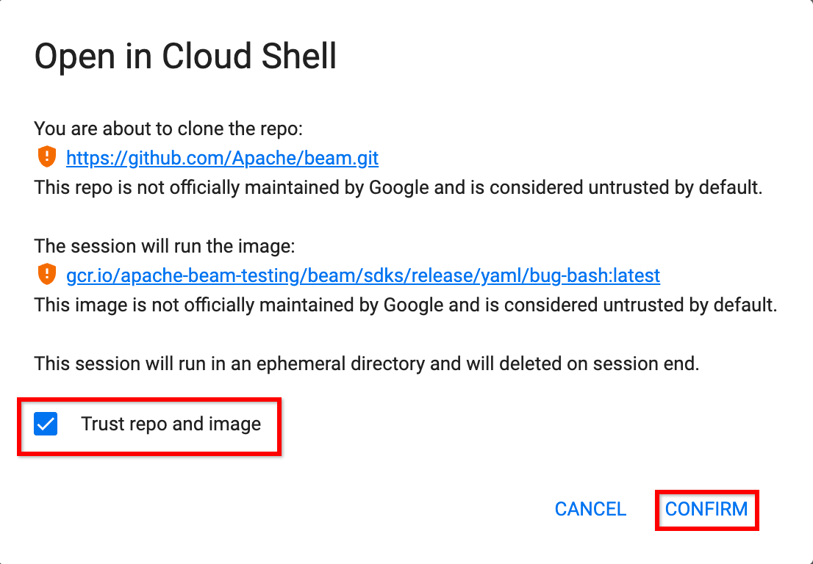
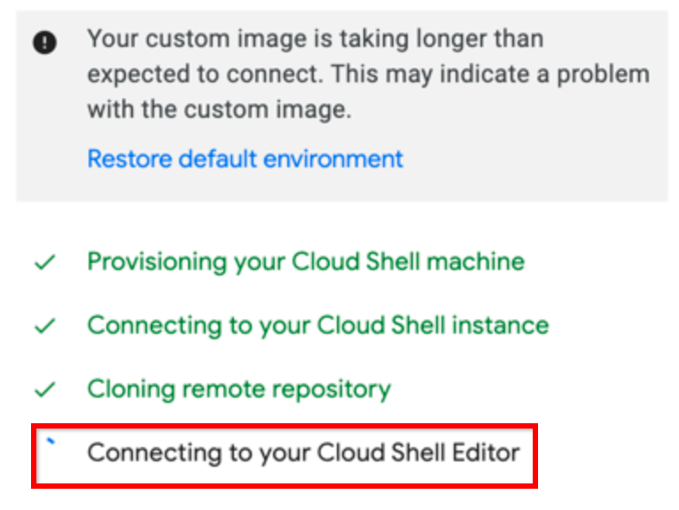
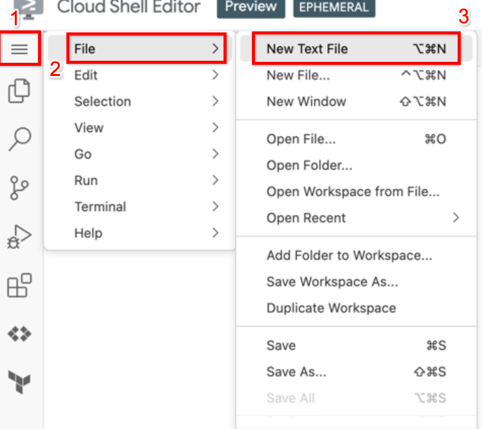
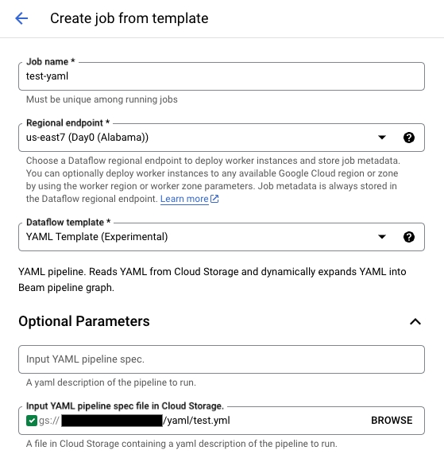

# Developing pipelines with Beam YAML

This tutorial provides a walkthrough for developing Beam YAML pipeline from Head
using Google Cloud Shell Editor as the development environment. This allows all
necessary dependencies to be pre-installed, removing the burden of setting of a 
dev environment and expediting the prototyping process.

## Setting up a Beam YAML dev environment 

### Option 1: Set up using Google Cloud Shell Editor
**Step 1.** Open the repository in Cloud Shell editor:

[](
https://console.cloud.google.com/cloudshell/editor?cloudshell_image=gcr.io/apache-beam-testing/beam/sdks/release/yaml/bug-bash:2.0.0&cloudshell_git_repo=https://github.com/Apache/beam.git&cloudshell_open_in_editor=sdks/python/apache_beam/yaml/README.md)

**Step 2.** Make sure to trust the repo and click 'CONFIRM'.


* **Note**: The initialization sometimes hangs on the 
"Connecting to your Cloud Shell Editor" step. If this occurs, just refresh the
page _after_ the other steps complete.


**Step 3.** Install Beam in editable mode by running the following command in 
the terminal tab at the bottom:

```
cd sdks/python && pip install -e .[gcp,test]
```

**Step 4.** Copy the xlang jars into the beam directory by running the following 
commands in the terminal tab
```
cp -r /beam/sdks/java/extensions/schemaio-expansion-service/build $HOME/cloudshell_open/beam/sdks/java/extensions/schemaio-expansion-service
cp -r /beam/sdks/java/extensions/sql/expansion-service/build $HOME/cloudshell_open/beam/sdks/java/extensions/sql/expansion-service
cp -r /beam/sdks/java/io/expansion-service/build $HOME/cloudshell_open/beam/sdks/java/io/expansion-service
cp -r /beam/sdks/java/io/google-cloud-platform/expansion-service/build $HOME/cloudshell_open/beam/sdks/java/io/google-cloud-platform/expansion-service
```

The `apache_beam` module is now installed, so the YAML pipelines can be authored
and run from any directory. For now, change directories to HOME by running the 
following command:
```
cd $HOME
```

Your Beam YAML environment is now set up. Proceed to section [Authoring and running a Beam YAML pipeline locally](#Authoring and running a Beam YAML pipeline locally)

### Option 2: Build from source
**Prerequisites**:
- Install Beam Java SDK dependencies using the following [link](https://beam.apache.org/get-started/quickstart-java/#set-up-your-development-environment)
  - Supports JDK versions 8, 11, or 17
- Install Beam Python SDK dependencies using the following [link](https://cwiki.apache.org/confluence/display/BEAM/Python+Tips)
  - Supports python versions 3.8-3.11

**Step 1.** Clone the repository
```
git clone https://github.com/apache/beam.git && cd beam
```

**Step 2.** Build the expansion service jars (these are needed to run 
cross-language transforms)
```
./gradlew sdks:java:extensions:schemaio-expansion-service:shadowJar
./gradlew sdks:java:extensions:sql:expansion-service:shadowJar
./gradlew sdks:java:io:expansion-service:shadowJar
./gradlew sdks:java:io:google-cloud-platform:expansion-service:shadowJar
```

**Step 3.** Install Beam Python SDK in editable mode if not already done in 
prerequisites section.
```
cd sdks/python && pip install -e .[gcp,test]
```
Your Beam YAML environment is now set up.

## Authoring and running a Beam YAML pipeline

**Step 1.** Create a new file called `test.yml`

In Cloud Shell, navigate to "New Text File"


**Step 2.** Paste the following contents into the file
```
pipeline:
  type: chain
  transforms:
    - type: Create
      config:
        elements:
          - {num1: 0, num2: 1}
          - {num1: 2, num2: 3}
          - {num1: 4, num2: 5}
    - type: MapToFields
      config:
        language: python
        append: true
        fields: 
          sum: num1 + num2
    - type: LogForTesting
```
This simple pipeline will add a column `sum` that is the sum of the 2 other 
columns, `num1` and `num2`. The output data is then logged to the console.

Step 3. Save the file

In Cloud Shell Editor, it will be under `File > Save As` similar to step 1.


**Step 4.** Execute the test example by running the following command in the
bottom terminal tab:
```
python -m apache_beam.yaml.main --pipeline_spec_file=test.yml
```

This should output the following:
```
INFO:root:Row(num1=0, num2=1, sum=1)
INFO:root:Row(num1=2, num2=3, sum=5)
INFO:root:Row(num1=4, num2=5, sum=9)
```

**Step 5.** (Optional) Run on Dataflow

**Note**: This requires a GCP project with all necessary Dataflow API's enabled.
For more information on getting started with dataflow, see the official 
[documentation](
https://cloud.google.com/dataflow/docs/quickstarts/create-pipeline-python).
* **Option 1** : Add the following options to the YAML file
    ```
    pipeline:
      type: chain
      transforms:
        - type: Create
          config:
            elements:
              - {num1: 0, num2: 1}
              - {num1: 2, num2: 3}
              - {num1: 4, num2: 5}
        - type: MapToFields
          config:
            language: python
            append: true
            fields: 
              sum: num1 + num2
        - type: LogForTesting
        
    options:
      runner: dataflow
      sdk_location: container
      
      # Modify these with your project and region
      project: <your-gcp-project>
      region: <valid-gcp-region>
    ```
* **Option 2**: Passing the arguments directly to the run command
    ```
    python -m apache_beam.yaml.main \
      --pipeline_spec_file=test.yml \
      --runner=dataflow \
      --sdk_location=container
      --project=<your-gcp-project> \
      --region=<valid-gcp-region>
    ```

## Running the YAML pipeline on Dataflow using a Dataflow template
This section will go over running the YAML pipeline using the experimental 
Dataflow template. This will require a GCP project with all necessary Dataflow 
API's enabled.
For more information on getting started with dataflow, see the official 
[documentation](
https://cloud.google.com/dataflow/docs/quickstarts/create-pipeline-python).

**NOTE** - The YAML template is **NOT** available in the following regions at 
  the time of writing:
  * europe-west3, europe-west4, europe-west8, europe-west9
  * me-central1, me-central2
  * me-west1
  * us-central1
  * us-east1, us-east4, us-east5
  * us-south1
  * us-west1, us-west2, us-west8

Make sure to update the region option in the YAML file or in the run command to 
use a valid region. (Tested with `asia-east-1`)

**Step 1.** Create a GCS bucket. This can be done through the UI at
this [link](https://pantheon.corp.google.com/storage/browser) or by running the following command:
```
gcloud storage buckets create gs://my-bucket
```
with more advanced options documented [here](
https://cloud.google.com/sdk/gcloud/reference/storage/buckets/create)

**Step 2.** Upload the `test.yml` file from the 
[Authoring and running a Beam YAML pipeline](
#Authoring and running a Beam YAML pipeline) section to the bucket.

**Step 3.** Run the YAML template
* **Option 1.** Using the UI
  * **Step 1.** Navigate to the following [link](https://pantheon.corp.google.com/dataflow/createjob).
  * **Step 2.** Fill in the Job Name, Region, and select YAML template from the dropdown


  * **Step 3.** Point the "Input YAML file..." parameter to the YAML file uploaded in step 2.

  * **Step 4.** Hit the "Run Job" button


* **Option 2.** Using the gcloud command
  * **Step 1.** Set REGION and YAML location
    ```
    REGION=<valid-gcp-region>
    YAML=<gcs-path-to-yaml-file>
    ```

  * **Step 2.** Run the following gcloud command, making sure to set the other 
  options in the YAML file as described in step 5, option 1 in the [Authoring and running a Beam YAML pipeline](#Authoring and running a Beam YAML pipeline) section
    ```
    gcloud dataflow flex-template run test-yaml-job \
      --template-file-gcs-location=gs://dataflow-templates-$REGION/latest/flex/YAML_Template_Python \
      --region=$REGION \
      --parameters=yaml="$YAML" \
      --max-workers=5
    ```
    
# Further reading
Now that you have a working Beam YAML development, please browse the 
documentation and other resources.

Beam YAML documentation:
* [Mapping transforms doc](yaml_mapping.md)
* [Aggregation transform doc](yaml_combine.md)
* [Error handling doc](yaml_errors.md)
* [Transform configurations doc](https://gist.github.com/robertwb/64e2f51ff88320eeb6ffd96634202df7)

Beam YAML examples catalog
* [Examples catalog](../examples/README.md)